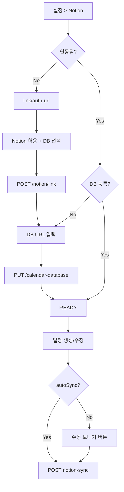

# Notion 연동 · 캘린더 동기화 — 프론트엔드 설계안

> 백엔드 API 기준 (2026-05). 상세 스펙은 Swagger `/swagger-ui/index.html` 참고.  
> 공통 인증·에러 처리는 [FRONTEND_GUIDE.md](./FRONTEND_GUIDE.md) 참고.

---

## 1. 목표

- 사용자는 **설정에서 1~2번**만 설정하면 이후 일정이 Notion으로 나갈 수 있게 한다.
- Notion Developers·Swagger·DB 수동 작업은 **사용자에게 노출하지 않는다**.
- Google 로그인 사용자가 **같은 MeetingApp 계정**에 Notion을 붙이는 플로우만 지원한다.  
  (Notion 단독 로그인 `/notion/auth-url` 은 본 설계 범위 외 — 별도 로그인 화면이 있을 때만 사용)

---

## 2. 사용자 상태 (State Machine)

프론트는 아래 3단계를 로컬 + API 응답으로 관리한다.

| 상태 | 조건 | UI |
|------|------|-----|
| `NOT_LINKED` | Notion OAuth 미완료 | 「Notion 연동하기」 CTA |
| `LINKED_NO_DB` | 연동됐으나 캘린더 DB 미등록 | 「캘린더 DB 연결」 2단계 위저드 |
| `READY` | 연동 + `calendarDatabaseId` 저장됨 | 「연동됨」 + 동기화 토글/버튼 |

### 상태 조회 (현재 백엔드)

**전용 `GET /notion/status` API는 없음.** MVP에서는 다음으로 판단:

1. **로컬 저장** (권장): 설정 완료 시 `notionSetupComplete: true`, `calendarDatabaseId` 캐시  
2. **시험적 판별**: `PUT /notion/calendar-database` 성공 이력  
3. **동기화 시도**: `POST .../notion-sync` 실패 메시지로 403/400 구분  

**백엔드 추가 권장** (프론트 부담 감소):

```
GET /api/oauth2/notion/status
→ { linked: boolean, notionName?: string, calendarDatabaseId?: string }
```

---

## 3. 화면 구성

### 3.1 설정 > Notion 연동 (메인)

**경로 예:** `/settings/integrations/notion`

```
┌─────────────────────────────────────────┐
│  Notion 연동                             │
├─────────────────────────────────────────┤
│  [상태 뱃지: 미연동 | 연동됨]              │
│                                          │
│  MeetingApp 일정을 Notion 캘린더 DB에      │
│  보낼 수 있습니다. (1회 설정)              │
│                                          │
│  [ Notion 연동하기 ]        ← NOT_LINKED   │
│  또는                                    │
│  연동 계정: 홍길동 (Notion)  ← LINKED+    │
│  캘린더 DB: (등록됨 / 미등록)              │
│  [ DB 다시 설정 ] [ 연동 해제 ]           │
│                                          │
│  □ 일정 생성 시 Notion에 자동 반영  ← READY│
└─────────────────────────────────────────┘
```

**카피 (사용자용)**

- 연동 전: 「Notion에서 허용한 뒤, 캘린더로 쓸 데이터베이스 주소만 알려주면 됩니다.」
- OAuth 안내: 「Notion 화면에서 **전체 페이지 데이터베이스**를 선택해 주세요. 일반 페이지는 사용할 수 없습니다.」

---

### 3.2 연동 마법사 (3단계, 모달 또는 전용 페이지)

#### Step 1 — Notion OAuth

| 항목 | 내용 |
|------|------|
| 버튼 | 「Notion 연동하기」 |
| API | `GET /api/oauth2/notion/link/auth-url` |
| 동작 | 응답 `authUrl`로 **전체 페이지 이동** (`window.location.href`) |

**웹 redirect 처리 (필수)**

백엔드 redirect URI: `{baseUrl}/api/oauth2/notion/link/callback`

현재 callback은 **JSON**만 반환하므로, 프로덕션에서는 다음 중 하나를 택한다.

| 방식 | 설명 |
|------|------|
| **A. 프론트 callback 페이지 (권장)** | Notion Integration redirect를 `https://app.example.com/oauth/notion/callback` 로 등록하고, 프론트가 `code`를 받아 `POST /api/oauth2/notion/link` 호출. (백엔드 redirect URI 추가 협의 필요) |
| **B. 임시: 백엔드 JSON callback** | `link/callback?code=...` 로 이동 → 사용자가 JSON 보는 UX 나쁨 → **개발용만** |
| **C. 팝업 + postMessage** | popup으로 authUrl 열고 callback 페이지에서 부모 창에 code 전달 |

**MVP (백엔드 callback 유지 시)**

1. `authUrl` 새 탭 오픈  
2. 사용자가 JSON에서 `code` 복사… → **비권장**  
3. → **백엔드에 프론트 redirect URL 추가 요청**을 일정에 넣을 것

**Step 1 완료 API**

```http
POST /api/oauth2/notion/link
Authorization: Bearer {accessToken}
Content-Type: application/json

{ "code": "{oauth_code}" }
```

성공 응답:

```json
{
  "message": "Notion account linked successfully",
  "userId": 1,
  "notionName": "권성호"
}
```

→ 상태 `LINKED_NO_DB` 로 전환, Step 2로

---

#### Step 2 — 캘린더 DB URL 입력

| 항목 | 내용 |
|------|------|
| 입력 | Notion **데이터베이스** 페이지 링크 (전체 페이지 DB) |
| API | `PUT /api/oauth2/notion/calendar-database` |
| body | `{ "databaseUrl": "https://www.notion.so/..." }` 또는 `{ "databaseId": "32자리hex" }` |

**인앱 가이드 (접이식)**

1. Notion에서 `+ 새 페이지` → `/데이터베이스` → 표 또는 캘린더  
2. 열 이름: `Name`(제목), `Date`(날짜, 종료일 켜기)  
3. DB 페이지 `···` → 링크 복사  
4. OAuth 허용 화면에서 **이 DB 페이지 체크**

**검증**

- URL 붙여넣기 후 저장 → (선택) 테스트 동기화 1회  
- 실패 시 에러 코드별 메시지 (§6)

---

#### Step 3 — 완료

- 「연동이 완료되었습니다」  
- (선택) 테스트 일정 1건 `notion-sync`  
- 설정 화면으로 복귀, 상태 `READY`

---

### 3.3 일정(Event) UI 연동

#### 일정 목록 / 상세

| 요소 | 동작 |
|------|------|
| 아이콘/뱃지 | Notion 반영 여부 (로컬: `notionPageId` 저장 시 백엔드 필드 없음 → MVP는 sync 성공 후 로컬 맵 또는 재시도 허용) |
| 버튼 「Notion에 보내기」 | `READY` 일 때만 활성 |
| 자동 동기화 토글 | 설정 `autoSyncNotion` 이 true이고 `READY` 이면 생성/수정 후 sync |

#### API

```http
POST /api/calendar/events/{eventId}/notion-sync
Authorization: Bearer {accessToken}
```

성공:

```json
{ "eventId": 5, "notionPageId": "..." }
```

일괄 (같은 워크스페이스·본인 생성 일정):

```http
POST /api/calendar/workspaces/{workspaceId}/notion-sync
```

선택 일정:

```http
POST /api/calendar/events/notion-sync-batch
{ "eventIds": [1, 2, 3] }
```

#### AI 분석 후 (Gemini)

`POST /api/meetings/transcripts/{id}/gemini-analyze` 성공 후 생성된 `events` 각각에 대해:

- `autoSyncNotion === true` → 배치 sync 또는 개별 sync  
- false → 일정 목록에 「Notion 미반영」 표시 + 일괄 보내기 CTA

---

## 4. API 호출 순서 (웹 SPA 기준)

### 4.1 최초 설정 (Google 로그인 사용자)

```
1. POST /api/oauth2/google/callback  (또는 GET callback — 로그인)
   → accessToken 저장

2. GET /api/oauth2/notion/link/auth-url
   → authUrl 로 redirect

3. [callback] code 획득
   POST /api/oauth2/notion/link  { code }
   → linked

4. PUT /api/oauth2/notion/calendar-database  { databaseUrl }
   → READY

5. (선택) POST /api/calendar/events/{id}/notion-sync
```

### 4.2 일상 사용

```
일정 POST /api/events
  → (autoSync) POST /api/calendar/events/{id}/notion-sync
```

---

## 5. Google vs Notion OAuth 구분 (실수 방지)

| 용도 | auth-url | callback | 비고 |
|------|----------|----------|------|
| Google **로그인** | `GET /google/auth-url` | `POST /google/callback` | JWT 발급 |
| Notion **로그인** | `GET /notion/auth-url` | `POST /notion/callback` | 별도 계정 생성 가능 — **설정 연동에 쓰지 말 것** |
| Notion **연동** (Google 계정에 붙이기) | `GET /notion/link/auth-url` | code → `POST /notion/link` | **설정 화면은 이것만** |

---

## 6. 에러 → 사용자 메시지 매핑

| 백엔드/Notion 상황 | HTTP | 사용자 메시지 (예) | 프론트 액션 |
|-------------------|------|-------------------|-------------|
| JWT 없음 | 401 | 로그인이 필요합니다 | 로그인 이동 |
| Notion 미연동 | 403 `Notion account is not linked` | Notion 연동을 먼저 완료해 주세요 | 마법사 Step 1 |
| DB 미등록 | 400 `캘린더 데이터베이스를 먼저 등록` | 캘린더 DB를 설정해 주세요 | Step 2 |
| `is a page, not a database` | 400 | 일반 페이지가 아닌 **데이터베이스** 링크를 사용해 주세요 | Step 2 가이드 펼치기 |
| `object_not_found` / shared with integration | 404 | Notion에서 이 DB에 앱 접근을 허용해 주세요 | 「다시 연동」→ OAuth + DB 체크 안내 |
| property `Name`/`Date` 불일치 | 400 | Notion DB에 `Name`, `Date` 열이 필요합니다 | 가이드 링크 |
| 워크스페이스 비멤버 | 403 | 이 일정에 대한 권한이 없습니다 | — |

---

## 7. 로컬 저장 키 (제안)

```ts
// settings
notionAutoSync: boolean          // 일정 자동 반영
notionSetupComplete: boolean     // wizard 완료
notionLinkedName: string | null  // link API의 notionName

// optional — sync 이력 (백엔드에 notionPageId 없을 때)
notionSyncedEventIds: Record<eventId, notionPageId>
```

---

## 8. Notion DB 요구사항 (설정 화면 도움말용)

- **전체 페이지 Database** (인라인 DB X)
- 속성: `Name` (Title), `Date` (Date, end date 가능)
- OAuth 또는 `···` → 연결에서 Integration(예: 일정 관리 앱) 허용

---

## 9. 백엔드 협의 요청 (프론트 편의)

| 우선순위 | API | 이유 |
|----------|-----|------|
| P0 | 프론트용 OAuth redirect (`/oauth/notion/callback` → 앱 복귀) | JSON callback 제거 |
| P1 | `GET /api/oauth2/notion/status` | 설정 화면 상태 표시 |
| P2 | `resolveDatabaseId` URL에서 32자리 ID 추출 | 잘못된 ID 저장 방지 |
| P3 | `events.notion_page_id` 컬럼 + 응답 포함 | 중복 sync 방지, UI 뱃지 |

---

## 10. QA 체크리스트

- [ ] Google 로그인 후 Notion 연동 → **동일 userId** 유지
- [ ] `/notion/auth-url`(로그인)과 `/notion/link/auth-url`(연동) 혼용 시 실패 재현·방지
- [ ] 전체 페이지 DB URL 저장 후 sync 성공
- [ ] 인라인 DB / 일반 페이지 URL → 친절한 에러
- [ ] OAuth 시 DB 미선택 → 404 후 「다시 연동」플로우
- [ ] 자동 sync 켜고 이벤트 생성 → Notion에 행 추가
- [ ] 401 시 refresh 후 재시도

---

## 11. 화면 플로우 다이어그램



---

## 12. FRONTEND_GUIDE.md 와의 관계

- 로그인: `POST /api/oauth2/google/callback` (가이드의 `/google` 경로는 구버전 — 이 문서 기준 적용)
- 일정 CRUD: FRONTEND_GUIDE §11
- Notion: **이 문서**가 SSOT
